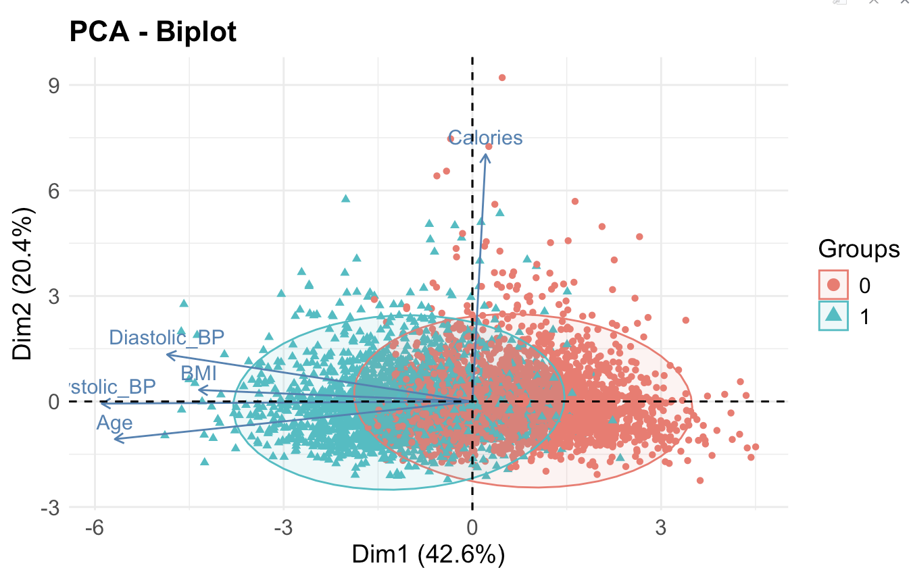
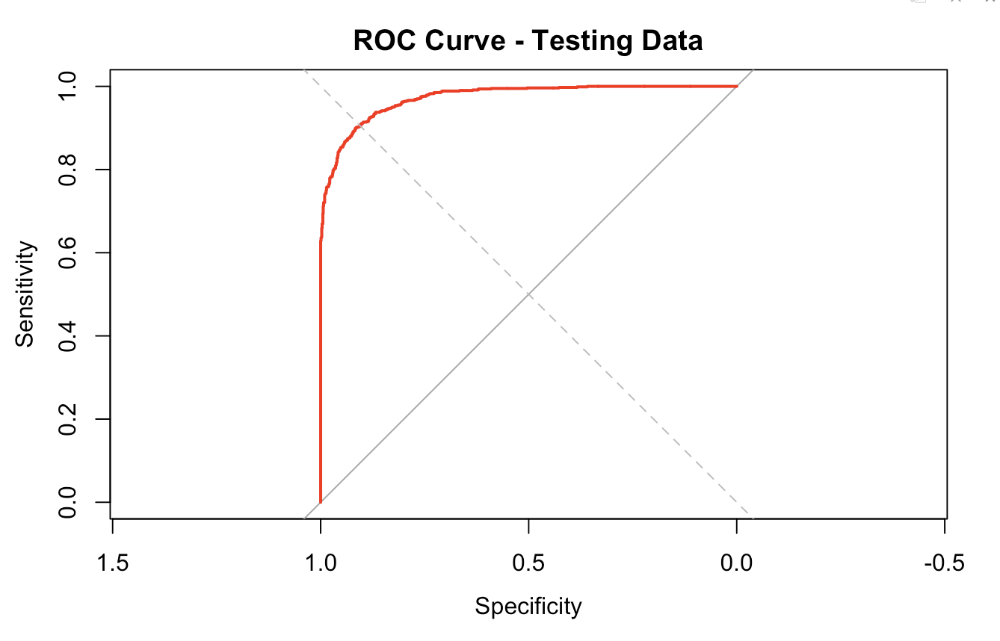

# 🚀 Predicting Cardiovascular Risk Using Machine Learning 🩺  

## Introduction: A Fight Against the Silent Killer 💔  

Cardiovascular diseases (CVDs) are the leading cause of death worldwide, accounting for millions of lives lost annually. Identifying individuals at risk early can help implement preventive strategies and save lives. The challenge? Finding the right tools to predict this risk effectively.  

In this project, I used machine learning techniques—Principal Component Analysis (PCA), K-Means Clustering, and LASSO Logistic Regression—to identify high-risk individuals based on health data from the NHANES dataset.  

## Data Overview 📊

I used the National Health and Nutrition Examination Survey (NHANES) dataset, which includes key demographic, physiological, and dietary features:  

- Population: 6,488 adults aged 18–80  
- Key Features:  
   - Demographic: Age  
   - Physiological: BMI, Systolic BP, Diastolic BP  
   - Dietary: Calorie Intake  

Risk Label:  
Participants were classified as High Risk (1) if they met at least one of the following:  
1. Systolic BP > 130 mmHg  
2. BMI > 30 kg/m²  

Otherwise, they were labeled as Low Risk (0).  

## Methodology 🛠️

I applied three key machine learning techniques to analyze and predict CVD risk:  

### 1. Principal Component Analysis (PCA)
PCA reduces dimensionality while preserving the most important information. The formula for PCA is:  

$$
Z = XW
$$
Where:  
- $Z$ = Principal components  
- $X$ = Standardized data matrix  
- $W$ = Eigenvectors  

Objective: Identify the most influential variables contributing to CVD risk.  

Result: 

- PC1 captured 42.8% of variance and aligned with Age and BMI.  
- PC2 explained 20.4% of variance, focusing on Systolic BP and Diastolic BP.  

### 2. K-Means Clustering 🤖 
K-Means was applied to PCA components to identify subgroups within the data. The objective was to minimize within-cluster variance:
  
$$
\arg \min_\mu \sum_{i=1}^k \sum_{x \in C_i} ||x - \mu_i||^2
$$

Result:  

The population was divided into three distinct clusters:  

| Cluster | Avg Age | BMI | Systolic BP | CVD Risk Proportion |  
|-------------|-------------|---------|-----------------|-------------------------|  
| 1       | 56.85       | 31.11   | 130.8           | 72%                     |  
| 2       | 21.41       | 23.11   | 105.5           | 11%                     |  
| 3       | 35.60       | 27.80   | 117.02          | 36%                     |  

Insights:  
- Cluster 1: Older individuals with high BMI and elevated blood pressure → High Risk  
- Cluster 2: Young individuals with healthy BMI and BP → Low Risk  
- Cluster 3: Middle-aged individuals with moderate BMI → Medium Risk  

### 3. LASSO Logistic Regression 📉
LASSO regression shrinks insignificant predictors to zero, focusing only on the most influential features. The loss function includes a penalty term:  

$$
\text{minimize}_{\beta_0, \beta} \left\{ \sum_{i=1}^n \left( y_i - \beta_0 - \sum_{j=1}^p \beta_j x_{ij} \right)^2 + \lambda \sum_{j=1}^p |\beta_j| \right\}
$$ 

Results (Top Predictors): 

| Variable       | Coefficient |  
|---------------------|-----------------|  
| Intercept       | -36.06          |  
| Age             | 0.003           |  
| BMI             | 0.609           |  
| Systolic BP     | 0.161           |  
| Diastolic BP    | -0.008          |  
| Calories        | -0.0001         |  

Model Performance:  
The model achieved excellent predictive accuracy:  
- AUC: 0.975  
- Sensitivity: 87.2%  
- Specificity: 93.6%  

## Results and Discussion 📈  

### Key Takeaways 

1. BMI and Systolic BP are the most significant predictors of CVD risk.  
2. Cluster Analysis identified three groups, highlighting the need for targeted interventions:  
   - Cluster 1: Requires immediate focus → older, obese individuals with hypertension.  
   - Cluster 2: Low-risk group → prevention strategies to maintain health.  
   - Cluster 3: Medium-risk → benefit from health management programs.  

3. The LASSO model’s high accuracy proves its reliability for predicting CVD risk.  

## Visual Results 📊

1. PCA Biplot: Visualize variable contributions to CVD risk.  
2. K-Means Cluster Plot: Show the distinct clusters based on PCA components.  
3. LASSO Coefficient Table: Highlight the importance of each predictor.  
4. ROC Curve: Demonstrates the model’s high predictive performance.  

## Challenges Faced 💡
1. Multicollinearity: Addressed using PCA for dimensionality reduction.  
2. Optimal Clustering: Achieved using the Elbow Method.  
3. Model Tuning: Finding the best regularization parameter $\lambda$ for LASSO.

## Conclusion: Insights for Public Health 🌍 

This study demonstrates the power of machine learning in predicting cardiovascular risk. By combining PCA, K-Means Clustering, and LASSO Regression, I:  
- identified key predictors of CVD risk: BMI, Systolic BP, and Age.  
- segmented the population into meaningful clusters for targeted intervention.  

These findings can guide public health strategies to focus resources on high-risk individuals and promote preventive healthcare.  

## Future Directions 🚀

1. Use longitudinal data to monitor CVD risk over time.  
2. Explore advanced models like Deep Learning for complex interactions.  
3. Apply this framework to global datasets for broader impact.

## Thank You! 💻✨  
*"Let’s use data to solve real-world problems and create a healthier world!"*  
